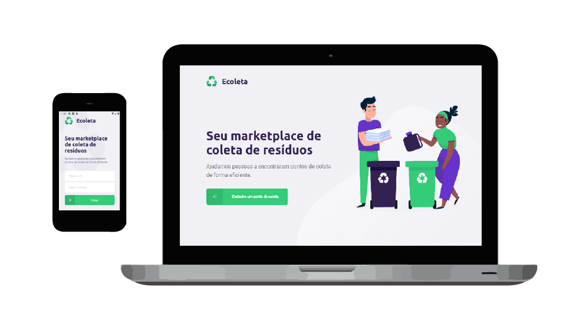

<!-- VARS -->
[live-demo-url]: https://chap0lin-ecoleta-nlw1-web.herokuapp.com/
[back-end-url]: https://chap0lin-ecoleta-nlw1-server.herokuapp.com/
[react-badge]: https://img.shields.io/badge/react-%5E16.13.1-%2300d8ff
[typescript-badge]: https://img.shields.io/badge/typescript-%5E3.7.5-%232d79c7
[node-badge]: https://img.shields.io/badge/node-v12.9.1-%238bc500
[expo-badge]: https://img.shields.io/badge/expo-~37.0.3-%23000020
[reactnative-badge]: https://img.shields.io/badge/react--native-~0.61.17-%2300d8ff
[knex-badge]: https://img.shields.io/badge/knex-%5E0.21.1-%23e16426
[heroku-badge]: https://img.shields.io/badge/heroku-active-%238052bc

<!-- VARS -->
<div align="center">
    ![Node][node-badge]
    ![React][react-badge]
    ![Typescript][typescript-badge]
    ![React-Native][reactnative-badge]
    ![Expo][expo-badge]
    ![Knex][knex-badge]
    ![Heroku][heroku-badge]
</div>
# Ecoleta - NLW#1
<p align="center" >
    
</p>

## :memo: Descrição
Aplicação para conectar empresas e/ou entidades que coletam resíduos (orgânicos e inorgânicos) às pessoas e/ou entidades que necessitam descartar esses resíduos.

## :rocket: Como usar
Para testar a aplicação basta acessar o [link][live-demo-url].<br>
O servidor backend está hospedado na plataforma [Heroku][back-end-url].
O servidor do frontend também está hospedado lá, não é o ideal pois demora um pouco para inicializar a aplicação, mas estava aprendendo a usar a plataforma e decidi fazer todo o deploy por lá.
<!--## :book: Features

-->
## :computer: Como instalar
```sh
    # Clonando o projeto
    $ git clone https://github.com/chap0lin/Ecoleta_NLW-1.git
    $ cd Ecoleta_NLW-1
    
    # Backend
    $ cd server
    $ npm install
    $ npm run knex:migrate
    $ npm run knex:seed
    $ npm run dev
    
    # Frontend
    $ cd ..
    $ cd web
    $ npm install
    $ npm start
    
    # Mobile
    $ cd ..
    $ cd mobile
    $ npm install
    $ expo start
```
## :key: Licença
Esse projeto está sob a licença MIT. Veja o arquivo [LICENSE](LICENSE.md) para mais detalhes.
## :gear: Processo
### :zap: Motivação:
A [Rocketseat](https://rocketseat.com.br/) anunciou a primeira edição da Next Level Week com o propósito de desenvolver uma aplicação full stack (backend, web e mobile) em uma semana. Durante esse período, eu estava cansado de implementar apenas projetos pequenos e estava planejando começar a montar um portfólio de projetos maiores. Então decidi me inscrever na semana e implementar o projeto.
### :wrench: Dificuldades:
O Projeto se deu sem grandes dificuldades, os únicos desafios que demandaram mais tempo foram os de deploy. Naquela época eu ainda não havia feito um deploy para um servidor externo. Rodava as aplicações em versão de produção mas no localhost em minha própria máquina.
### :bulb: Soluções:
Optei por utilizar o Heroku para fazer o deploy da aplicação por completo, por mais que ele seja mais aconselhado para o backend (em sua versão gratuita). Como ele não possui um bundle padrão para a execução de react apps completamente via heroku cli, eu precisei instalar um servidor express na aplicação para servir os arquivos gerados na build de maneira estática e assim permitir o acesso ao frontend da aplicação.
### :checkered_flag: Créditos:
O crédito da aplicação vai para [Diego Fernandes](https://github.com/diego3g) e equipe [rocketseat](https://rocketseat.com.br/) que desenvolveu toda essa ideia de projeto e ajudou MUITO na implementação.
